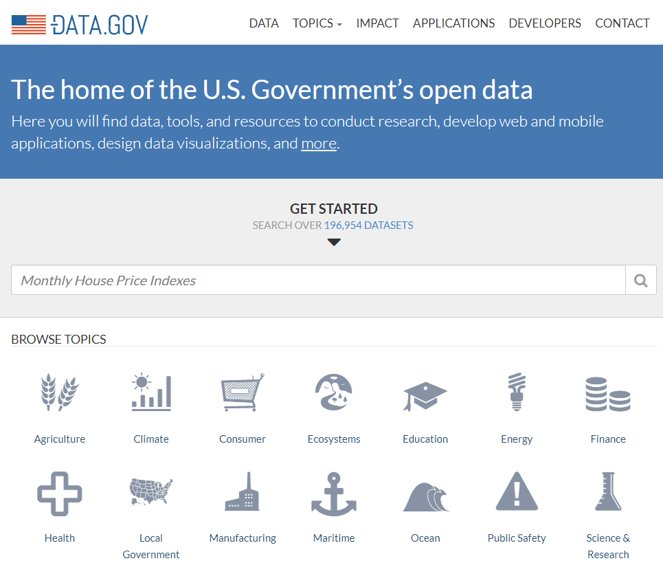

<h3>Getting Started With Data.gov</h3>

(https://www.data.gov/)

<h3>Finding a Dataset</h3>

Data.gov is easy to navigate, and locating a dataset that interests you is as simple as searching their [data catalog](https://catalog.data.gov/). For this post, we'll be looking at NOAA's [Hourly Precipitation Rate by State](https://www.ncdc.noaa.gov/IPS/hpd/hpd.html). 

<h3>Data.gov CKAN API</h3>

You can fetch metadata for data.gov data sets, including URLs and data descriptions, by visiting the CKAN API at: [http://catalog.data.gov/api/3/](http://catalog.data.gov/api/3/), but you'll have to visit each agency's API if you would like to extract data. Not every federal agency has an API at the time of this writing. 

https://axibase.github.io/atsd-use-cases/SocrataPython/
